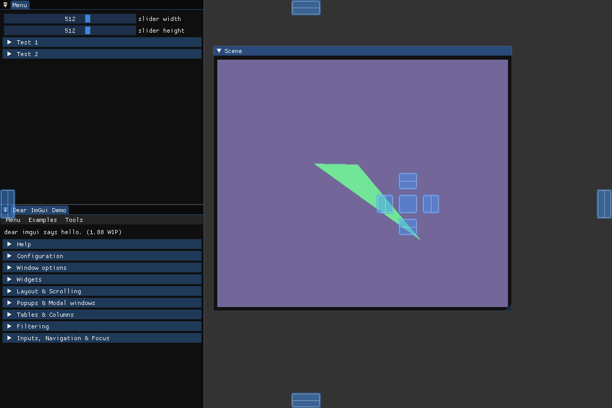

# Example downloading, compiling and linking ImGui to your project

See [ImGui.cmake](cmake/ImGui.cmake) for more info

```cmake

include(cmake/ImGui.cmake)

target_link_libraries(${PROJECT_NAME} ImGui)

```

#### Example with rendering inside ImGui window with framebuffer
